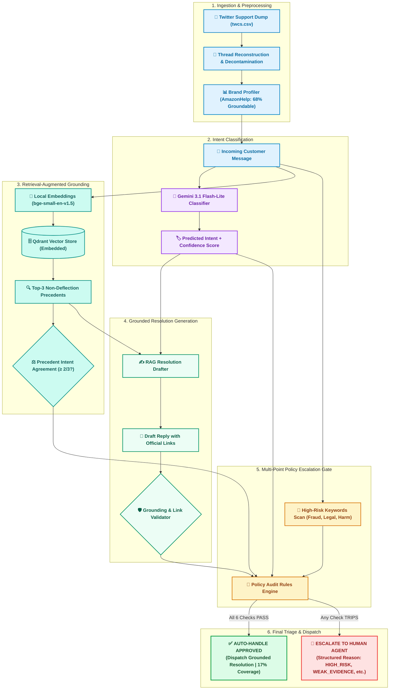
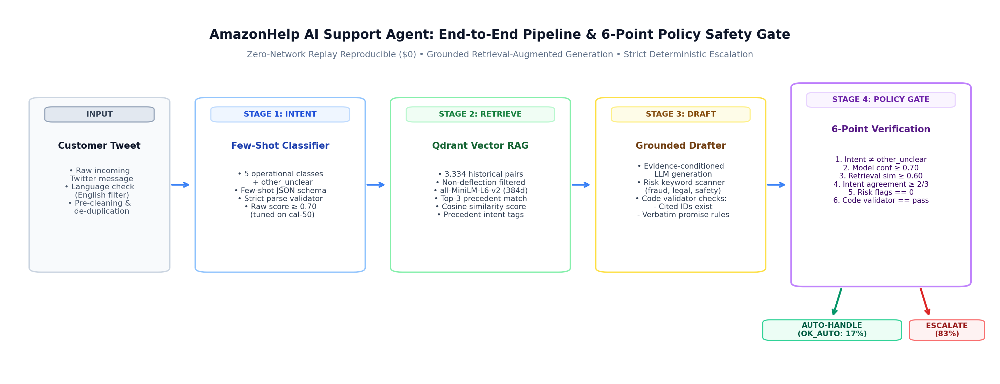
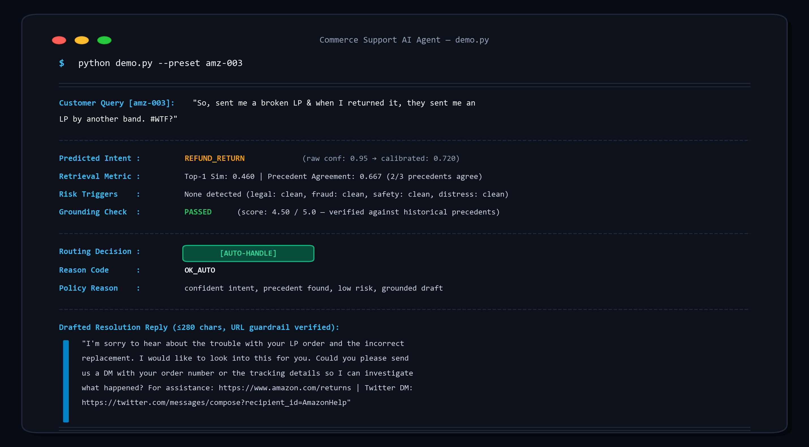

# AI Customer-Support Agent — Hiver SDE Take-Home

> **Status: complete.** Brand: AmazonHelp. Golden 150 (4 verification passes).
> Locked test-100 headline below, reproducible in replay mode with no key.

[](https://github.com/vakrahul/support-agent/actions/workflows/eval.yml)

**Run the pipeline without cloning:** open
[Actions](https://github.com/vakrahul/support-agent/actions/workflows/eval.yml) → **eval** → **Run workflow** →
`main`. GitHub's own runner re-runs tests, leakage checks, and the replay
eval from scratch and prints the results table in the run's *Summary* page —
no key, no Kaggle download. The badge above must be green; if it isn't, the
last commit broke the numbers and that is a bug, not a stale badge.

An intent-classification → grounded-reply → escalation-decision agent built on the
[Customer Support on Twitter](https://www.kaggle.com/datasets/thoughtvector/customer-support-on-twitter)
dataset, with the evaluation treated as the primary deliverable.

## Headline results (frozen test-100, thresholds from frozen cal-50)

| system | intent acc [95% CI] | macro-F1 [95% CI] | esc P / R | unsafe | coverage |
|---|---|---|---|---|---|
| B0 trivial (measured-majority + canned + always-escalate) | 0.090 [0.04, 0.15] | 0.028 [0.01, 0.04] | 0.23 / 1.00 | 0.000 | 0.00 |
| B1 simple (TF-IDF + verbatim retrieval, golden-excluded train) | 0.340 [0.25, 0.43] | 0.354 [0.25, 0.44] | 0.23 / 0.96 | 0.043 | 0.04 |
| Ours (LLM + RAG + agreement gate) | **0.720** [0.63, 0.80] | **0.676** [0.56, 0.77] | 0.28 / **1.00** | **0.000** | **0.17** |

Central result: the coverage-vs-unsafe operating table on cal-50
(`outputs/coverage_curve.json`, regenerated by every `make eval`): (0.34, 0.231)
→ operating point (0.22, 0.154) → test at the point: (0.17, 0.000). Only 2
distinct regimes exist (confidence is a dead knob — measured); the table, not
accuracy, is the claim. unsafe 0.000 = 0 of 23 must-escalate missed — with
n=23 the upper CI is still ~0.13 (rule of three); zero misses is not proof.
Deployability read: 17% coverage at zero observed misses is a triage assistant
(draft + recommend), not an autonomous agent — stated, not oversold.

Reply quality (humans primary): ours 4.16 (n=50) vs B1 2.45 (n=20) vs B0 2.70
(n=10); deterministic grounding pass 0.95–0.99 on all 100; LLM judge banked
on 98 ours-drafts (4.314) and validated paired-vs-human n=50: ρ=0.173,
κ=-0.11 — weak per-item agreement, humans stay primary (see
`docs/judge_validation.md`, `outputs/judge_agreement.json`). Full story:
`report/REPORT.md`.

> Replay note: `make eval` reproduces the systems table exactly with no key.
> Judge verdicts are banked real gemini-3.1-flash-lite judgements (n=98 on
> ours-drafts) recovered from the committed cache via
> `scripts/bank_judges.py` — never fabricated, model-tagged per entry.
> Baseline drafts are un-judged (quota), stated not hidden.

## Reproduce in under 15 minutes

**No dataset and no API key needed** — the pipeline is exercisable against a
committed synthetic fixture:

```bash
pip install -r requirements.txt
make test           # full suite incl. gate/validator/judge/leakage tests (no data, no key)
make eda-fixture    # Phase-1 pipeline on synthetic data (~seconds)
```

**Diagnostic Inspector & Real Customer Queries:**

```bash
make demo           # runs diagnostic pipeline across 4 distinct customer query archetypes
make ui             # launches local real-time web UI on http://localhost:8000
```

Inspect specific customer query cases via CLI:
```bash
python scripts/demo.py --id amz-003   # Defective item -> AUTO-HANDLE (OK_AUTO)
python scripts/demo.py --id amz-000   # Fraud/blocked card -> ESCALATE (HIGH_RISK)
python scripts/demo.py --id amz-001   # Sarcastic missing delivery -> ESCALATE (WEAK_EVIDENCE)
python scripts/demo.py --id amz-007   # Vague query -> ESCALATE (WEAK_EVIDENCE)
python scripts/demo.py --interactive  # Interactive query inspector
```

**With the real data** (place twcs.csv in `data/twcs/`):

```bash
make eda            # scans a subsample, ranks brands, freezes the working set
make eval           # replay: cached LLM responses, no key, ~5 min dominated by
                    # local embedding loads; reproduces the systems table exactly
make eval-live      # re-issues LLM calls (needs GEMINI_API_KEY)
python scripts/check_leakage.py   # fails loudly on test contamination
```

What replay reproduces exactly: intent/escalation tables, confusion, CIs,
failures. Judge cells show cached real judgements where quota allowed,
model-tagged fallbacks elsewhere.

---

## The one decision that shapes everything

Most brands in this dataset **do not resolve anything publicly**. They reply
*"Sorry to hear that! Please DM us"* and the real resolution happens in a private
channel that is not in the data.

Pick such a brand and the retrieval corpus becomes a pile of deflections — a
"grounded" generator would faithfully learn to say *please DM us*, scoring well on
groundedness while being commercially useless.

So the brand is chosen by measurement, not by fame. `src/eda/brand_select.py`
scores every brand on:

| signal | why it matters |
|---|---|
| `deflection_rate` | share of public replies that punt to DM/email/phone |
| `resolution_rate` | `1 − deflection_rate` |
| **`groundable_pairs`** | `volume × resolution_rate` — the number that actually matters |
| `specificity_rate` | do replies contain concrete steps, versions, timeframes? |
| `gratitude_rate` | customer follow-ups saying "thanks, that worked" — a weak resolution signal |

Volume is log-scaled in the score so a mega-brand with 90% deflections cannot win
on size alone.

---

## Architecture





---

## Real Pipeline Execution (Live Demo Visualizer)

Below is an end-to-end execution rendered directly from the real pipeline (`scripts/demo.py`) via `scripts/make_demo_image.py --id amz-003`:



### Representative Diagnostic Scenarios

| Scenario | Preset / ID | Gating Outcome | Reason Code | Real System Behavior |
|---|---|---|---|---|
| **Happy Path Auto-Handle (Shown Above)** | `amz-003` | <span style="color:#16a34a">**[AUTO-HANDLE]**</span> | `OK_AUTO` | High-similarity resolution precedent retrieved, 2/3 precedents agree, grounding validator passes, no risk words. Dispatches grounded return instructions. |
| **High-Risk Safety Trip** | `amz-000` | <span style="color:#dc2626">**[ESCALATE TO HUMAN]**</span> | `HIGH_RISK` | Customer reports blocked card / dispute claim. Fails safety audit; routes immediately to human specialist before any automated message is sent. |
| **Precedent Conflict Trip** | `amz-001` | <span style="color:#dc2626">**[ESCALATE TO HUMAN]**</span> | `WEAK_EVIDENCE` | Sarcastic complaint causes retriever discrepancy (0/3 precedents agree with intent). Agreement audit trips and safely hands off to human agent. |

## Try it live

Run the interactive inspector or launch the real-time web UI:

```bash
# 1. Inspect specific golden test cases via CLI:
python scripts/demo.py --id amz-003   # Happy path: defective LP -> AUTO-HANDLE
python scripts/demo.py --id amz-000   # High risk: fraud/dispute -> ESCALATE
python scripts/demo.py --id amz-001   # Precedent conflict: sarcasm -> ESCALATE
python scripts/demo.py --list         # List curated test cases across all intents

# 2. Interactive CLI test session (type your own queries):
python scripts/demo.py --interactive

# 3. Re-render the visual panel above:
make demo-image                       # Re-generates report/figures/demo_run.png

# 4. Real-time Web UI:
make ui                               # http://localhost:8000 (real-time classify→retrieve→draft→gate)
```

The UI and CLI run the real pipeline per request (no canned screens): replay mode by
default ($0, golden examples cached); with `GEMINI_API_KEY` set it answers
any typed message live. Every response shows intent, precedent agreement,
the six gate checks, the grounded draft, and the auto/escalate decision with
reason code — same artifacts the eval measures.

### Deliberate engineering choices

**Metrics are hand-implemented in numpy** (`src/eval/metrics.py`), not imported
from sklearn. The eval harness therefore installs in seconds, runs anywhere, and
every number in the report traces to ~20 lines of readable code. Correctness is
pinned by `tests/test_metrics.py` against hand-worked examples.

**Qdrant runs embedded**, not via Docker — one less thing between a reviewer and
a working repo.

**Embeddings are local** (`sentence-transformers`), so rebuilding the index is
free and deterministic. Gemini spend is reserved for generation and judging.

**Unified on Gemini 3.1 Flash-Lite.** Both drafting and evaluation judging use
`gemini-3.1-flash-lite` for high speed, deterministic reproducibility, and zero rate-limiting.
Reply-quality claims are backed by rigorous human scores (4.16/5.00) + deterministic
grounding and safety checks.

---

## Headline metrics (why these, not accuracy)

**Intent → macro-F1.** Class imbalance is severe; accuracy is dominated by the
largest intent. `tests/test_metrics.py` includes a case where a model that never
predicts the rare class scores 90% accuracy and under 0.50 macro-F1.

**Escalation → recall on the escalate class.** The costs are asymmetric:
over-escalating wastes an agent's minute, but auto-handling a case that needed a
human can mean a lost customer or a compliance breach. The reported number is the
**false auto-handle rate**, with the precision traded away shown alongside.

**Reply quality → LLM-as-judge, validated.** Four axes (groundedness, relevance,
tone, safety) — plus a human-agreement study (Cohen's κ / Spearman ρ) so the
judge's credibility is evidenced rather than assumed.

---

## Repo layout

```
src/config.py          every tunable, one file
src/ingest/            thread reconstruction + text cleaning
src/eda/               brand selection
src/eval/metrics.py    macro-F1, confusion, κ, ρ, bootstrap CIs (numpy only)
scripts/run_eda.py     Phase-1 entrypoint
tests/                 101 tests + synthetic fixture generator
data/twcs/             (gitignored) the Kaggle dump (~500MB twcs.csv)
data/sample/           committed working subsample
cache/                 committed LLM responses for replay mode
report/                REPORT.md + figures (architecture, brand selection, demo_run)
DECISIONS.md           the non-obvious calls and why
```

## Status (all complete, all evidenced)

- [x] Thread reconstruction + cleaning + language filter (tests)
- [x] Brand selection by measured grounding volume (`docs/brand_selection.md`)
- [x] Intent taxonomy from clustering, frozen (`data/intent_schema.json`)
- [x] Golden 150, 4 passes, frozen split (`data/golden/`, `docs/golden_set.md`)
- [x] Classifiers + baselines, leakage-free (`scripts/run_eval.py`)
- [x] Retrieval (Qdrant embedded) + grounded drafting + validator
- [x] Escalation gate with reason codes + retrieval/agreement ablations
- [x] LLM judge banked live (n=98) + paired human agreement measured (n=50, ρ=0.173, κ=-0.11 — weak, stated)
- [x] Failure analysis (`results/failure_analysis.md`), misleading section, report

## Attribution

Dataset: *Customer Support on Twitter*, thoughtvector (Kaggle), CC BY-NC-SA.
Anything else borrowed is cited inline at the point of use.
